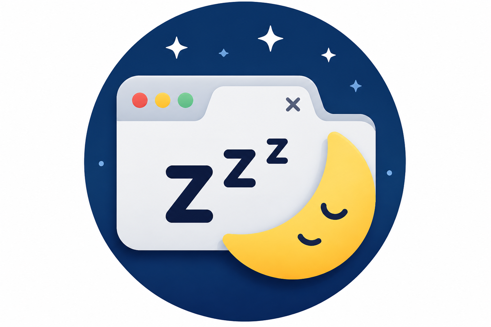

# Tab Snooze

<p align="center">
  
</p>

<p align="center"><strong>Close now, reopen later</strong></p>

<p align="center">
  <a href="https://github.com/Makogai/tab-snooze/releases">Releases</a> ·
  <a href="https://makogai.github.io/tab-snooze/">Website</a> ·
  <a href="https://makogai.github.io/tab-snooze/privacy.html">Privacy</a> ·
  <a href="https://github.com/Makogai/tab-snooze/issues">Issues</a>
</p>

**Tab Snooze** is a Chrome extension that closes a tab now and reopens it at a time you pick — 15 minutes, 1 hour, this evening, tomorrow morning, and more. Everything stays **on your device**; no account or cloud sync.

## Features

- **Quick snooze presets** from the toolbar popup
- **Snoozed list** — wake early, cancel, badge count
- **Notifications** when a tab returns
- **Light / dark themes** — System, Light, or Dark in Settings
- **Offline & private** — URLs stored in Chrome local storage only

## Development

Requires **Node.js 20+**.

```bash
git clone https://github.com/Makogai/tab-snooze.git
cd tab-snooze
npm install
npm run build
```

Load **`dist/`** in `chrome://extensions` (Developer mode → Load unpacked).

| Command | Description |
|---------|-------------|
| `npm run dev` | Watch mode |
| `npm run typecheck` | Vue/TS check |
| `npm run package` | Release ZIP in `release/` |

Part of the [Makogai Chrome extensions](../) suite — same styling as [Session Copy](https://github.com/Makogai/session-copy).

## License

[MIT](LICENSE)
